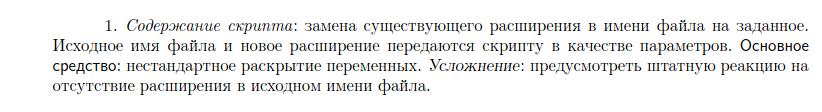
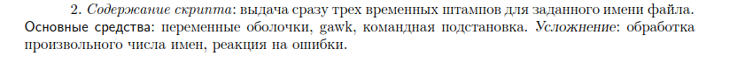
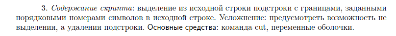

# AmberReview


Для обзора данного языка выполним [несколько заданий](http://www.astro.spbu.ru/sites/default/files/training_problems.pdf) для bash скриптов, используя Amber.

## Установка

Amber доступен только на Linux/MacOS. Про установку [подробнее](https://docs.amber-lang.com/getting_started/installation).

## Запуск скриптов

В корневой директории файла есть Makefile, который поможет вам собрать все скрипты (ниже запускать первого скрипта):

```bash
make
./change_filetype/output.sh change_filetype/test.log txt
```

Очистка всех .sh файлов, полученных в процессе компиляции .ab файлов:

```bash
make clean
```

## Задание 1. Смена расширения файла



```Amber
import {len, file_exist, exit, split} from "std"

main (args) {
	if len(args) != 2 {
		echo "Неправильное количество аргументов";
		exit(1);
	}
	let filename = args[0];
	let filetype = args[1];
	if not file_exist(filename){
		echo "Файл не существует";
		exit(1);
	}
	let splited = split(filename, ".");
	$mv {filename} {splited[0]}.{filetype}$ failed {
		echo "Не удалось конвертировать на расширение {filetype}";
	}	
}
```

Здесь ничего сложного нет, считываем полное имя файла (например, test.log в директории change_filetype) и новое расширение файла. Есть проверки на существование файла, количество аргументов. Переименование файла происходит с помощью **mv {old_filename} {new_filename}**.

## Задание 2. Выдача временных штампов



```Amber
import {len, exit, file_exist} from "std";

main(args) {
	loop i, arg in args {
		if not file_exist(arg) {
			echo "Файл {arg} не существует!";
		} else {
			let date_of_birth = unsafe $stat -c %w {arg}$;
        		let date_of_modification = unsafe $stat -c %y {arg}$;
        		let date_of_change = unsafe $stat -c %z {arg}$;
        		echo "Дата создания файла {arg} - {date_of_birth}";
        		echo "Дата модификации файла {arg} - {date_of_modification}";
        		echo "Дата изменения файла {arg} - {date_of_change}";
			echo "---------------------";
		}
	}
}
```

### Замечания

unsafe говорит о том, что не нужно ловить неправильные поведения команды (в данном случае stat).

stat -c %w - выводит только дату создания файла

stat -c %y - выводит только дату модификации файла

stat -c %z - выводит только дату изменений файла

Подробнее [manual stat](https://man7.org/linux/man-pages/man1/stat.1.html).

## Задание 3. Выделение последовательности символов



```Amber
import {input, file_exist, exit, split} from "std";

fun give_line_count(filename: Text) {
	return unsafe $grep -c \$ {filename}$;
}

fun check_line_number(line_number : Num, correct_line_number : Num) {
	if line_number < 0 or line_number > correct_line_number {
		echo "Incorrect line number!";
		exit(1);
	} else {
		if correct_line_number == 0 {
			echo "Empty file :(";
			exit(1);
		}
	}
}

fun give_sequence(filename: Text, line_number : Num, interval : Text) {
	let line = unsafe $sed -n {line_number}p {filename}$;
	let result = unsafe $echo "{line}" | cut -c {interval}$;
	return result;
}

main(args) {
	let filepath_request = "Write a path to file:\n";
	let interval_request = "Write an interval from line. Format - d-d:\n";
	let filepath = input(filepath_request);
	if not file_exist(filepath) {
		echo "Incorrect filepath!";
		exit(1);
	}
	let line_number_request = "Choose a line number from " + "{filepath}" + ":\n";
	let line_number = input(line_number_request) as Num;
	let correct_line_number = give_line_count(filepath) as Num;
	check_line_number(line_number, correct_line_number);
	let interval = input(interval_request);
	echo "Последовательность символов - " + give_sequence(filepath, line_number, interval);
}
```

### Замечания

grep -c - используем для подсчет количества строк в файле.

sed -n {line_number}p - используем для вывода строки по номеру {line_number}.

cut -c {interval} - используем для отображения последовательность {interval} вида %d-%d.

## References

Ссылка на [исходный код](https://github.com/Ph0enixKM/Amber) и [документацию](https://docs.amber-lang.com).
